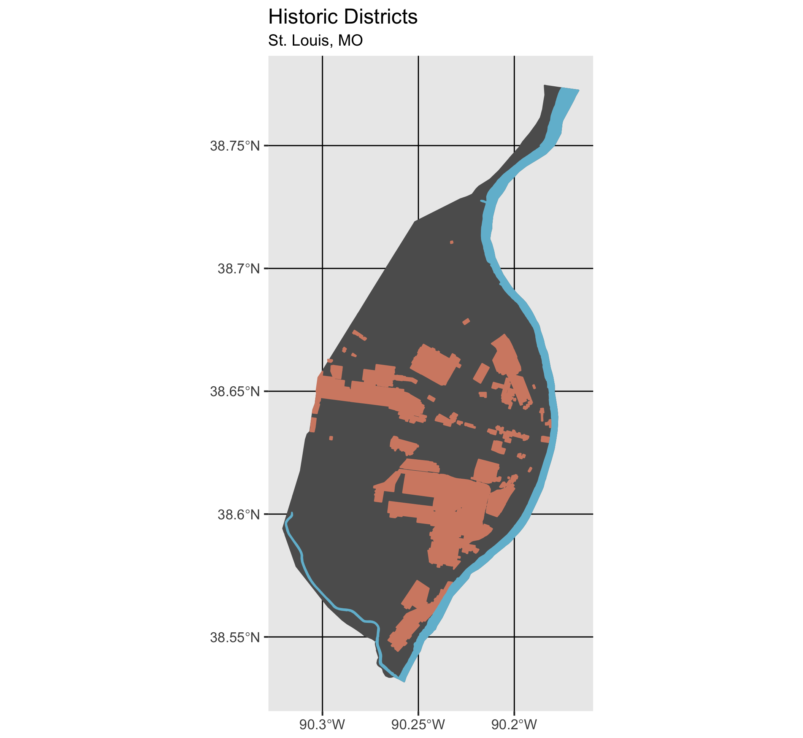
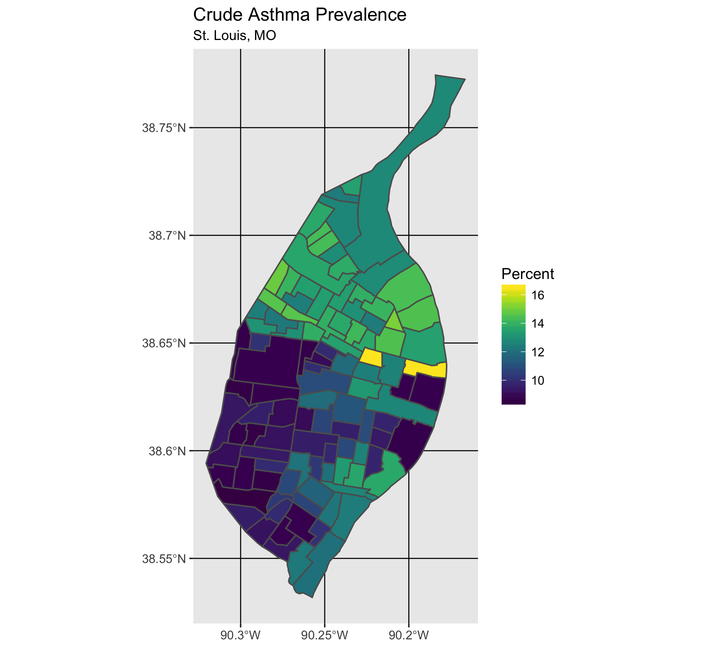

<!-- README.md is generated from README.Rmd. Please edit that file -->
stlData 
========================================================

[](https://travis-ci.org/chris-prener/stlData) [](https://ci.appveyor.com/project/chris-prener/stlData) [](https://zenodo.org/badge/latestdoi/85344799) [](https://cran.r-project.org/package=stlData)

The `stlData` package contains various datasets representing the City of St. Louis. These datasets are primary designed for teaching statistics, data science, and spatial data analysis using `R`.

Installation
------------

You can install `stlData` from [Github](https://github.com/chris-prener/stlData) with:

``` r
devtools::install_github("chris-prener/stlData")
```

Current Data
------------

### Simple Features

One gaol of `stlData` is to provide accessible data for learning how to manipulate and map simple features objects in `R`. The package contains four `sf` objects describing the City of St. Louis:

-   `stl_sf_boundary` - city boundary
-   `stl_sf_historic` - historic districts
-   `stl_sf_hydro` - Missouri side of the Mississippi River and the River Des Peres
-   `stl_sf_tracts` - 2016 census tracts

### Data Tables

The package currently contains eight data tables stored as tibbles with quanitative data about the city:

-   `stl_tbl_asthma` - current asthma prevalence in 2014 by census tract via [Centers for Disease Control 500 Cities Project](https://www.cdc.gov/500cities/)
-   `stl_tbl_income` - 2010 and 2015 median income estimates via the American Community Survey, by census tract
-   `stl_tbl_insurance` - lack of health insurance in 2014 by census tract via [Centers for Disease Control 500 Cities Project](https://www.cdc.gov/500cities/)
-   `stl_tbl_lead` - blood lead level test result data from 2010-2015 via [Reuters](http://www.reuters.com/investigates/special-report/usa-lead-testing/#interactive-lead) and 2015 5-year estimates for demographics (poverty and race) via the American Community Survey, by census tract
-   `stl_tbl_murders` - all murders between 2008 and 2016 via the St. Louis Metropolitan Police Department
-   `stl_tbl_sluPlaces` - a small number of locations at Saint Louis University, suitable for learning `leaflet`
-   `stl_tbl_smoking` - current smoking in 2014 by census tract via [Centers for Disease Control 500 Cities Project](https://www.cdc.gov/500cities/)
-   `stl_tbl_water` - rivers and streams listed under the Clean Water Act via the [Missouri Spatial Data Information Service](http://msdis.missouri.edu)

### Conversion of Tibbles to `sf` Objects

The following tibbles can be converted to `sf` objects using the `stl_as_sf()` function:

-   `stl_tbl_asthma`
-   `stl_tbl_income`
-   `stl_tbl_insurance`
-   `stl_tbl_lead`
-   `stl_tbl_smoking`

Input tables should not be quoted when the `stl_as_sf()` function is used:

``` r
asthma <- stl_as_sf(stl_tbl_asthma)
```

Useage
------

### Basic Usage

Once the package is loaded, the data contained in `stlData` can be assigned to data frames in your global environment and then explored. For example, to load the `stlAsthma` data:

``` r
library("stlData")
asthma <- stl_tbl_asthma
str(asthma)
```

Additional examples and information are available in each table's help file. For example:

``` r
?stl_tbl_asthma
```

### Mapping with `sf`

If you have the [development version of `ggplot2`](https://github.com/tidyverse/ggplot2), the `sf` objects in the package can be mapped using the `geom_sf()` function:

``` r
ggplot() + 
  geom_sf(data = stl_sf_boundary, fill = "#5d5d5d", color = "#5d5d5d") +
  geom_sf(data = stl_sf_historic, fill = "#d48a72", color = "#d48a72") +
  geom_sf(data = stl_sf_hydro, fill = "#72bcd4", color = "#72bcd4")  +
  labs(title = "Historic Districts", subtitle = "St. Louis, MO")
```



When the tibbles like `stl_tbl_asthma` are converted to `sf` objects, they can be mapped as well:

``` r
asthma <- stl_as_sf(stl_tbl_asthma)

ggplot() + 
  geom_sf(data = stl_sf_asthma, mapping = aes(fill = pctAsthma), color = "#5d5d5d") +
  scale_fill_viridis(name = "Percent") +
  labs(title = "Crude Asthma Prevalence", subtitle = "St. Louis, MO")
```



Contributor Code of Conduct
---------------------------

Please note that this project is released with a [Contributor Code of Conduct](CONDUCT.md). By participating in this project you agree to abide by its terms.
